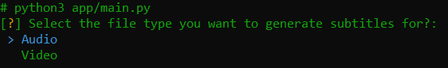
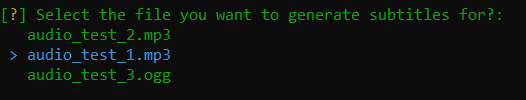
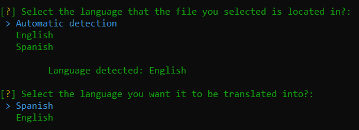
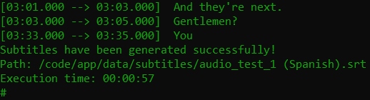

# Python OpenAI Generator Srt

---

Application that works offline written in python that transcribes and translates either audio or video files into text to generate a subtitle file (.srt) using deep learning libraries such as openai-whisper and argos-translate that contains the following functionalities:

<ul>
  <li>Audio to text transcriptions using the <a href="https://github.com/openai/whisper" target="_blank">OpenAI Whisper</a> library.</li>
  <li>Language selection for text translation using the <a href="https://github.com/argosopentech/argos-translate" target="_blank">Argos translate</a> library.</li>
  <li>Video to audio converter using the <a href="https://github.com/Zulko/moviepy" target="_blank">MoviePy</a> library.</li>
  <li>Selecting options using command line interface</li>
  <li>Exception handling.</li>
  <li>Enums.</li>
  <li>File Storage.</li>
  <li>Seeder are in JSON format.</li>
  <li>Environment Variable</li>
  <li>Python 3.12</li>
  <li>The project contains the files to deploy it in Docker.</li> 
</ul>

<h3>Screenshots CLI</h3>

 
 

 
 

 
 

<h3>Languages available default</h3>

You can add the languages ​​you want to translate by modifying the <a href="https://github.com/JAVI-CC/python-openai-generator-srt/blob/main/Dockerfile" target="_blank">Dockerfile</a> and <a href="https://github.com/JAVI-CC/python-openai-generator-srt/blob/main/app/dependencies/argos_translate/languages_available.json" target="_blank">languages_available.json</a> file.

It also contains the option to translate by the same language.

<table>
<thead>
<tr>
<th>To</th>
<th>From</th>
</tr>
</thead>
<tbody>
<tr>
<td>English</td>
<td>Spanish</td>
</tr>
<tr>
<td>Spanish</td>
<td>English</td>
</tr>
</tbody>
</table>

 

<h3>File storage</h3>

The supported formats for both audio and video files can be modified in the <a href="https://github.com/JAVI-CC/python-openai-generator-srt/blob/main/app/enums/file_type.py" target="_blank">file_type.py</a>.

<table>
<thead>
<tr>
<th>Name</th>
<th>Path</th>
<th>Description</th>
<th>Supported formats</th>
</tr>
</thead>
<tbody>
<tr>
<td>Audios</td>
<td>data/audios</td>
<td>Directory to save the audio files to later select and generate the subtitles.</td>
<td>
<ul>
<li>.mp3</li>
<li>.ogg</li>
</ul>
</td>
</tr>
<tr>
<td>Videos</td>
<td>data/videos</td>
<td>Directory to save video files that you can then select, convert into an audio file and generate subtitles.</td>
<td>
<ul>
<li>.mp4</li>
<li>.mov</li>
<li>.wmv</li>
<li>.avi</li>
<li>.avchd</li>
<li>.flv</li>
<li>.mkv</li>
<li>.webm</li>
<li>.html5</li>
<li>.mpeg-2</li>
</ul>
</td>
</tr>
<tr>
<td>Subtitles</td>
<td>data/subtitles</td>
<td>Once the subtitles have been generated in .srt format, the result will be saved in the data/subtitles folder.</td>
<td>
<ul>
<li>.srt</li>
</ul>
</td>
</tr>
</tbody>
</table>

<h3>Recommended requirements</h3>
<ul>
<li>Use an Nvidia graphics card that supports <a href="https://developer.nvidia.com/cuda-toolkit" target="_blank">CUDA</a> to run the application as it will significantly reduce the transcription process compared to the CPU.</li>
</ul>

<h3>Setup</h3>
<pre>
<code>apt-get install ffmpeg</code>
</pre>
<pre>
<code>$ cp .env.example .env # optional</code>
</pre>
<pre>
<code>$ pip install --no-cache-dir --upgrade -r requirements.txt</code>
</pre>
<pre>
<code>$ python app/main.py</code>
</pre>

<h2>Configure values in the .env file (Optional)</h2>

<pre><code>
<strong># [tiny, base, small, medium, large, turbo]</strong>
<strong>WHISPER_LOAD_MODEL="medium"</strong>
</code></pre>

 

<h2>Deploy to Docker <g-emoji class="g-emoji" alias="whale" fallback-src="https://github.githubassets.com/images/icons/emoji/unicode/1f433.png">🐳</g-emoji></h2>

Docker repository: <a href="https://hub.docker.com/r/javi98/python-openai-generator-srt" target="_blank">https://hub.docker.com/r/javi98/python-openai-generator-srt</a>

<h4>Requirements</h4>
<ul>
<li>Docker installed on your machine.</li>
<li>A machine with an NVIDIA GPU that supports CUDA.</li>
<li>Install the <a href="https://docs.nvidia.com/datacenter/cloud-native/container-toolkit/1.16.2/install-guide.html" target="_blank">NVIDIA Container Toolkit</a> to be able to use the GPU in a docker container.</li>
</ul>

<h4>Containers:</h4>
<ul>
<li>nvidia/cuda:12.5.1-base-ubuntu20.04</li>
</ul>

<h4>Containers structure:</h4>

<pre>├── python-openai-generator-srt-app</pre>

<h4>Setup:</h4>
<pre>
<code>$ git clone https://github.com/JAVI-CC/python-openai-generator-srt
$ cd python-openai-generator-srt
$ cp .env.example .env # optional
$ docker compose up -d
$ docker compose exec app python3 /code/app/app/main.py</code>
</pre>

 

Once you have the containers deployed, You will be shown the CLI to choose the file and language you want to generate the srt file in.
